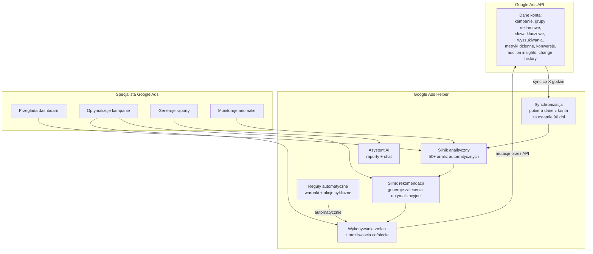
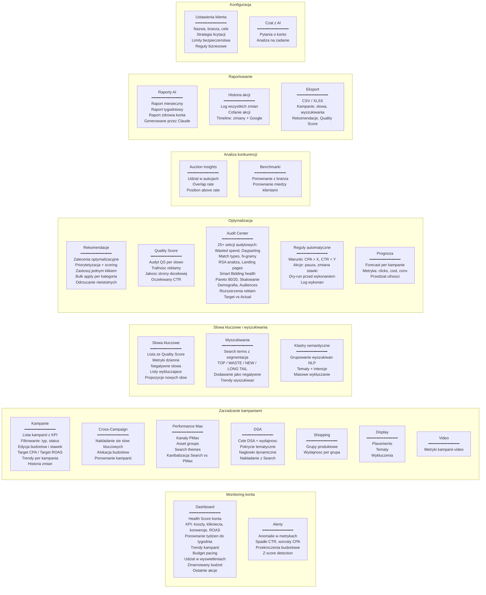
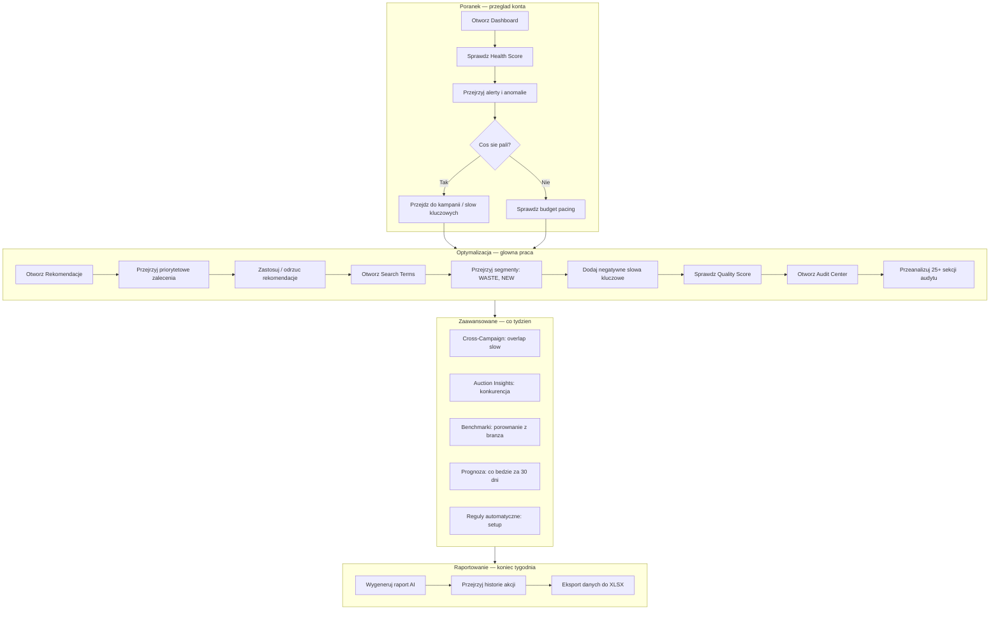
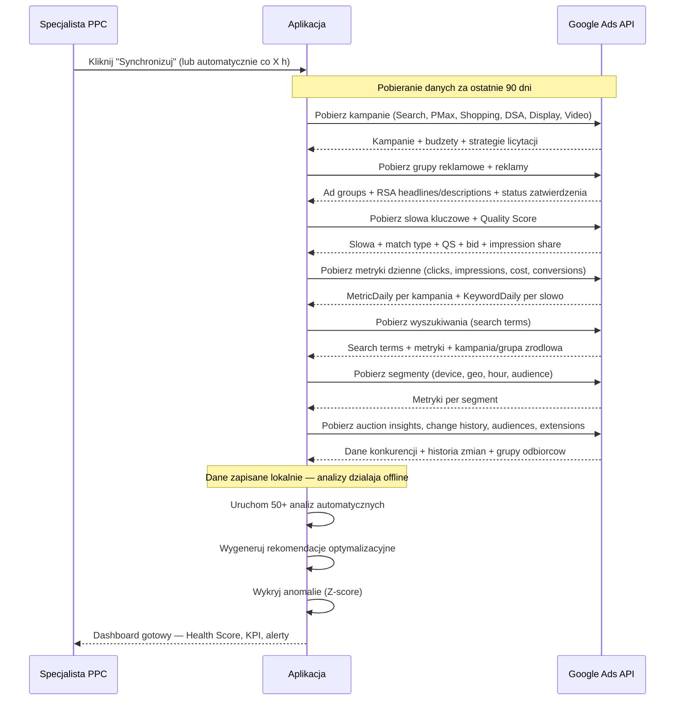
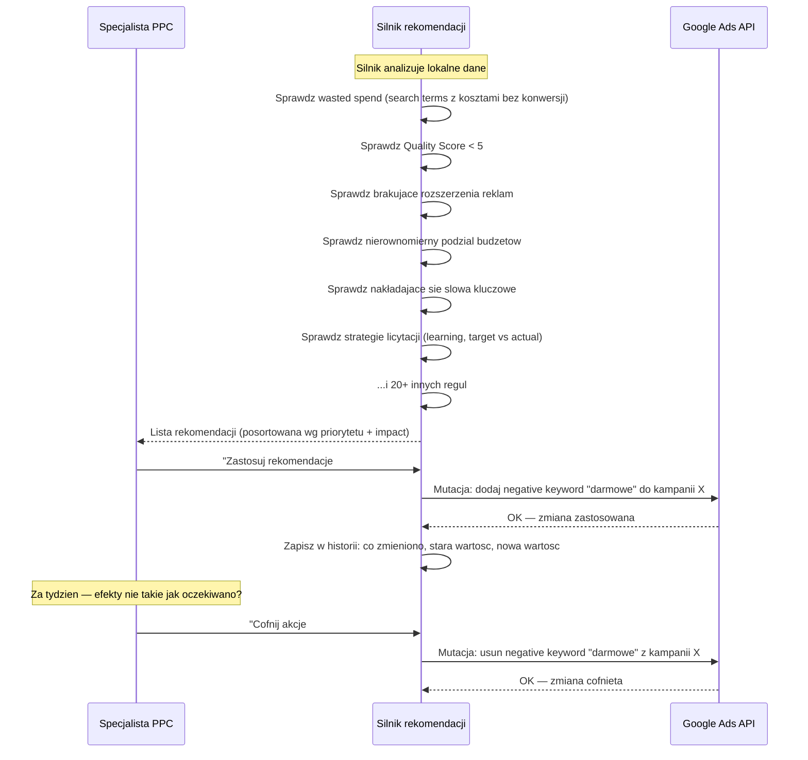
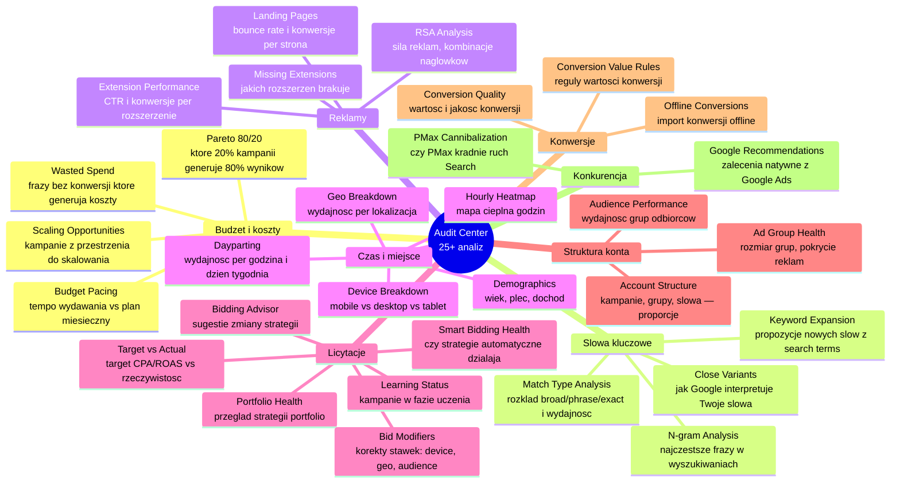
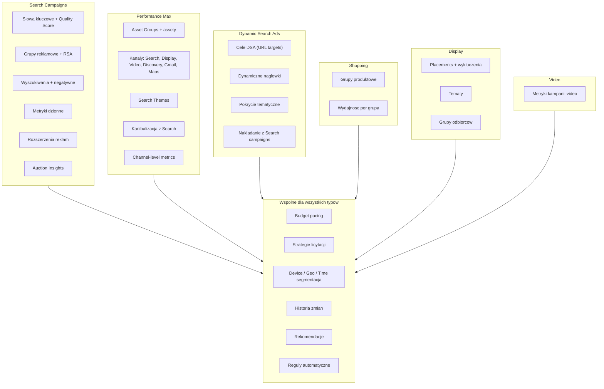
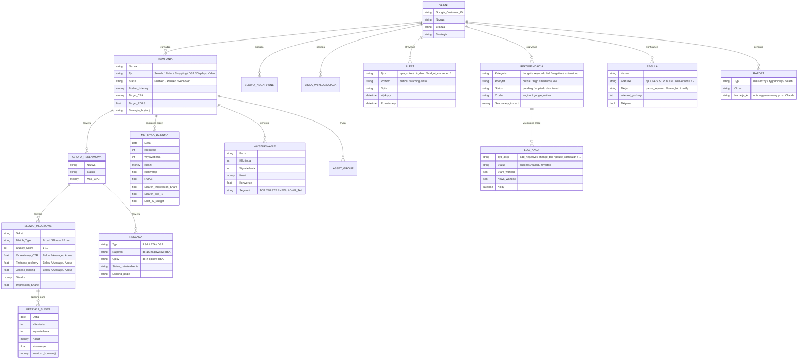
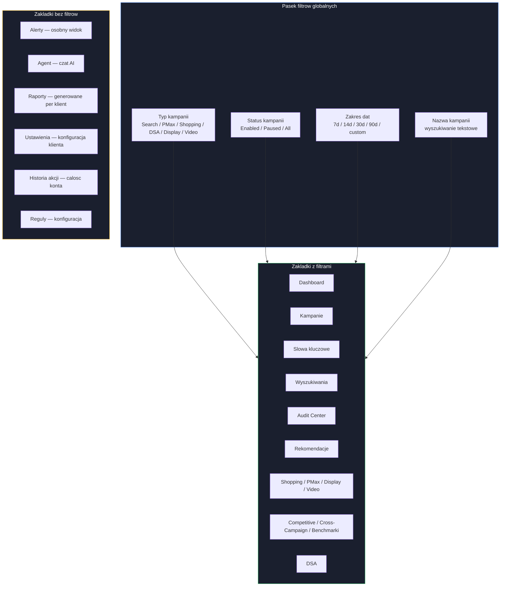

# Mapa Aplikacji — Google Ads Helper v1

Mapa funkcjonalnosci z perspektywy specjalisty Google Ads.
Otwórz w VS Code z rozszerzeniem "Markdown Preview Mermaid Support" lub wklej na [mermaid.live](https://mermaid.live).

---

## 1. Co robi aplikacja — widok z lotu ptaka

---

## 2. Zakladki aplikacji — co gdzie znajdziesz

---

## 3. Cykl pracy specjalisty — dzien z zycia PPCowca

---

## 4. Skad biora sie dane — pipeline synchronizacji

---

## 5. Jak dzialaja rekomendacje i akcje

---

## 6. Audit Center — co dokladnie sprawdza

---

## 7. Typy kampanii — co aplikacja obsluguje

---

## 8. Struktura danych — co aplikacja przechowuje

---

## 9. Filtry globalne — jak wplywaja na dane

---

> **Tip:** Zainstaluj rozszerzenie VS Code **"Markdown Preview Mermaid Support"** (`bierner.markdown-mermaid`) zeby renderowac diagramy bezposrednio w edytorze. Alternatywnie wklej na [mermaid.live](https://mermaid.live).
