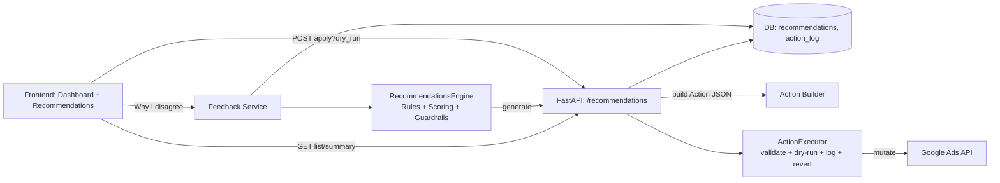
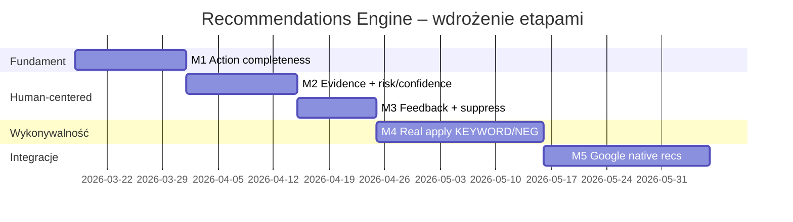

# Produkcyjny, human‑centered Recommendations Engine dla Google Ads Helper

## Executive summary

Repo już ma solidny “kręgosłup” pod Recommendations Engine: regułowy generator rekomendacji (17 reguł), persystencję w DB, endpointy (list/summary/apply/dismiss) oraz UI z **dry‑run → confirm → apply** i bulk actions. citeturn3view0turn5view0turn6view1turn6view2turn5view3turn5view1  
Największe luki produkcyjne to: (1) **nie‑wykonywalność** części rekomendacji (brak `ad_group_id`/`campaign_id` w metadanych dla typów, które ich wymagają), (2) **zbyt płaska logika budżetowa** (porównywanie ROAS bez kontekstu roli kampanii), (3) **deduplikacja bez scope** (ryzyko kolizji i/lub złej agregacji), (4) brak warstwy “ludzkiej niezgody”: system nie umie powiedzieć *kiedy i dlaczego użytkownik może mieć rację, odrzucając rekomendację* i nie zbiera feedbacku jako sygnału uczenia. citeturn6view0turn6view3turn7view2turn9view0  
Proponuję przejść na 2‑warstwowy model: **Recommendation (decyzja i wyjaśnienie)** + **Action (jednoznaczna, idempotentna operacja)**, dodać scoring (impact/confidence/risk) i obowiązkowy moduł “Why I disagree” z mapowaniem na reguły suppress/guardrails. To pozwoli wam utrzymać podejście rule‑based, ale podnieść jakość do poziomu production‑ready, przy zachowaniu pełnej kontroli człowieka (human‑in‑the‑loop). citeturn0search0turn0search10turn8search9

## Ocena obecnego repo i luki produkcyjne

### Komponenty, które już są “na miejscu”

Generator rekomendacji (`recommendations.py`) ma zdefiniowane typy, priorytety, progi, oraz tworzy obiekty rekomendacji z polami: `type`, `priority`, `entity_type`, `entity_id`, `entity_name`, `campaign_name`, `reason`, `category`, `current_value`, `recommended_action`, `estimated_impact`, `metadata`. citeturn6view7turn7view2turn6view4  
Endpointy API obejmują pełny podstawowy workflow: `GET /recommendations`, `GET /recommendations/summary`, `POST /recommendations/{id}/apply?dry_run=...`, `POST /recommendations/{id}/dismiss`. citeturn5view1turn6view1turn6view2  
UI Recommendations implementuje dokładnie bezpieczne zachowanie, które warto utrzymać: **preview (`dry_run=true`) → modal potwierdzenia → execute**, plus bulk apply/dismiss i licznik priorytetów. citeturn5view3turn6view2turn6view1  
Executor ma realne guardraile: limity zmian bid/budżetu, limit pauzowania keywordów per kampania, limit negatywów per dzień, okno cofania 24h i wyłączenia cofania tam, gdzie jest ryzykowne (np. `ADD_NEGATIVE`). citeturn9view0

### Najważniejsze luki

**Brak wymaganych identyfikatorów wykonawczych (execution correctness).**  
Router mapuje `ADD_KEYWORD` do akcji wymagającej `ad_group_id`, a `ADD_NEGATIVE`/`NGRAM_NEGATIVE` do akcji wymagającej `campaign_id`. citeturn6view3  
Tymczasem reguła “Add Search Term as Keyword” wytwarza `metadata` bez `ad_group_id` (i bez wyboru ad‑group), a reguły negatywów wytwarzają `metadata` bez `campaign_id`, mimo że w zapytaniu agregacyjnym kampania jest dostępna. citeturn7view2turn6view6turn7view3  
Efekt produkcyjny: część kart będzie kończyć się błędem na etapie apply (albo będzie “lokalnie wykonana”, a nie w Google).

**Deduplikacja bez scope.**  
Klucz dedupe to `type|entity_type|entity_id|entity_name` (w komentarzu jako “rule_type + entity…”). To nie uwzględnia `campaign_id/ad_group_id` jako scope. citeturn6view0  
Dla search terms macie też przypadek `entity_id=0`, co dodatkowo ułatwia kolizje (ten sam tekst frazy w różnych kampaniach). citeturn6view6turn7view0

**Rekomendacja budżetowa jest “matematyczna”, ale nieludzka.**  
Reguła reallokacji budżetu (Rule 7) porównuje ROAS kampanii i sugeruje przeniesienie ~20% budżetu/dzień z “worst” do “best”, jeśli best_roas > worst_roas * ratio i jeśli “worst” ma większy budżet niż “best”. citeturn6view4turn5view3  
Na screenie: “Brand ma ROAS 430.25x vs PMax 5.50x → przenieś budżet”. To typowy przykład, gdzie użytkownik może się nie zgodzić, bo **Brand** i **PMax/Local** zwykle mają różne role (capture popytu vs generowanie/rozproszone domykanie), a ROAS bywa nieporównywalny (atrybucja, outliery, mały koszt w brandzie, itp.). UI nie daje miejsca na te kontrargumenty.

**Warstwa wyjaśnień jest krucha (regex tłumaczący `reason`).**  
Frontend tłumaczy powody przez regex‑replace na stringach `reason`. To działa jako MVP, ale produkcyjnie lepiej przejść na pola strukturalne (`reason_short`, `evidence[]`) i i18n po stronie UI. citeturn5view3turn6view7

**Prośba o dodatkowe pliki (dla pełnej weryfikacji).**  
Żeby zakończyć audit “execution correctness” bez założeń, przyda się tabela (ścieżka → rola) dla: `backend/app/models/action_log.py`, `backend/app/routers/actions.py`, `backend/app/models/client.py`, `backend/app/models/keyword.py` (szczególnie relacje do kampanii i ad group) oraz ewentualnych usług mutacji “negatives/keywords” jeśli są w innych plikach niż główny serwis.

## Proponowany model danych Recommendation + Action

Obecny model DB (`recommendations`) trzyma m.in. `rule_id`, `entity_type`, `entity_id`, `entity_name`, `priority`, `category`, `reason`, `suggested_action` (JSON), `status`, `created_at`, `applied_at`. citeturn5view0turn6view0  
Proponuję znormalizować to do dwóch warstw:

- **Recommendation** = “co to jest, dlaczego i z jaką pewnością” (human‑centered)
- **Action** = “co dokładnie i jak wykonać” (production‑ready, idempotentne)

### Tabela A — current vs proposed fields

| Obszar | Obecnie (repo) | Proponowane (produkcyjne) |
|---|---|---|
| Idempotencja | dedupe key: `type|entity_type|entity_id|entity_name` citeturn6view0 | `stable_key = hash(type + scope + target_ids + rule_version)` + `generated_at`, `expires_at` |
| Scope | częściowo w `metadata`, niejawne citeturn7view3turn7view2 | `scope: {client_id, campaign_id, ad_group_id, channel_type, geo/device?}` jawnie |
| Source | brak | `source: PLAYBOOK_RULE / GOOGLE_NATIVE / HYBRID`, `rule_id`, `rule_version` |
| Evidence | `metadata` (nieustrukt.) + `reason` (string) citeturn6view7turn5view3 | `evidence[]` (metryka, wartość, okno czasu, porównanie, link do widoku), `reason_short`, `reason_long` |
| Impact | `estimated_impact` jako tekst citeturn6view7 | `impact_estimate: {delta_cost, delta_conv, delta_value, delta_roas, horizon_days, range?}` liczbowo |
| Confidence / Risk | brak | `confidence_score [0..1]`, `risk_score [0..1]` + `risk_reasons[]` |
| Preconditions | brak | `preconditions[]` (np. “campaign still ENABLED”, “term not already keyword”) |
| Wykonanie | `suggested_action` JSON, ale bywa niepełny (brak ids) citeturn6view3turn7view2 | `action: {action_type, target_ids, params, dry_run_supported, revertability}` |
| Feedback | tylko `dismiss`/`apply` status | `user_feedback: {agree/disagree, reason_code, note, suppress_days}`, event stream dla uczenia |

## Scoring i priorytetyzacja

Dziś priorytet jest ustawiany “w regule” (HIGH/MEDIUM/LOW) i sortowany. citeturn3view0turn6view7  
To nie wystarczy dla human‑centered engine, bo priorytet powinien też uwzględniać: ilość danych, outliery, ryzyko szkody oraz konflikt ról (np. Brand vs Prospecting).

### Proponowany scoring

Definicje (przykład):

- `impact` (0..1): normalizacja oczekiwanego wpływu (np. oszczędność/mies. lub zysk wartości konwersji)
- `confidence` (0..1): jakość sygnału (np. min clicks/conv, stabilność trendu)
- `risk` (0..1): ryzyko błędnej rekomendacji (np. role mismatch, mała próbka, kampania eksperyment, Smart Bidding w fazie uczenia)

Prosty, odporny wzór:

```
impact_norm = clamp(log1p(impact_usd_30d) / log1p(impact_cap), 0, 1)

confidence = clamp( 
  0.35 * sigmoid((clicks - 30)/15) +
  0.45 * sigmoid((conversions - 3)/2) +
  0.20 * stability_score,
  0, 1
)

risk = clamp(
  0.45 * role_mismatch +
  0.25 * small_sample +
  0.20 * outlier_roas +
  0.10 * policy_sensitive,
  0, 1
)

score = wI * impact_norm + wC * confidence - wR * risk
priority = HIGH if score >= 0.55 else MEDIUM if score >= 0.25 else LOW
```

To jest zgodne z praktyką “human review first”: nawet wysoki impact nie powinien wchodzić jako HIGH, jeśli ryzyko jest duże (np. Brand vs PMax). Dodatkowo: jeśli integrujecie natywne rekomendacje Google, pamiętajcie, że rekomendacje mogą szybko stać się nieaktualne i powinny być stosowane krótko po pobraniu. citeturn0search10turn0search0

### Tabela B — scenariusze wag (przykłady)

| Scenariusz | wI (impact) | wC (confidence) | wR (risk) | Kiedy użyć | Przykładowy efekt |
|---|---:|---:|---:|---|---|
| Performance‑first | 0.55 | 0.35 | 0.40 | e‑commerce, duże budżety, dużo danych | więcej HIGH, ale z blokadą na role mismatch |
| Risk‑averse | 0.45 | 0.40 | 0.65 | lead‑gen, miękkie konwersje, mało danych | większość budżetowych spada do MEDIUM/LOW |
| Exploration | 0.40 | 0.30 | 0.25 | nowe konto, faza uczenia | więcej LOW jako “testuj”, mało auto‑apply |

## Action Builder i Executor

Wasz executor ma dobry szkielet: `dry_run`, walidacja safety, logowanie, statusy error/blocked/success, revert window 24h. citeturn9view0turn6view2  
Żeby to było production‑ready, Action Builder musi “gwarantować kompletność”.

### Wymagania Action Builder (kontrakt)

1) **Jednoznaczny target**  
Każda akcja musi mieć minimalny zestaw ID:
- `PAUSE_KEYWORD` → keyword/internal id  
- `ADD_KEYWORD` → `ad_group_id` + `text` + `match_type` (dziś brakuje `ad_group_id` w wygenerowanych rec) citeturn6view3turn7view2  
- `ADD_NEGATIVE` → `campaign_id` (albo account‑level flag) + `text` + `match_type` (dziś brakuje `campaign_id`) citeturn6view3turn6view6  
- `REALLOCATE_BUDGET` → `from_campaign_id`, `to_campaign_id`, `delta_budget` (dziś w regule brakuje jawnych IDs w akcji) citeturn6view4turn6view3  

2) **Preconditions**  
Przed wykonaniem (a po dry‑run) sprawdzajcie: status encji, czy bid/budget nie zmienił się od czasu wygenerowania, czy fraza nie jest już keyword/negative.

3) **Idempotencja**  
`stable_key` + “already applied?” + “already exists?” (np. keyword już dodany). Dedupe oparte o tekst bez scope jest niewystarczające. citeturn6view0turn7view0

4) **Mapowanie do Google Ads API**  
Jeśli integrujecie natywne rekomendacje Google: używacie RecommendationService (retrieve/apply/dismiss) i pamiętacie, że “obsolete recommendations throw error when applied”, więc trzeba je stosować możliwie szybko. citeturn0search0turn0search10turn0search6  
Dodatkowo: w Google Ads Help jest ważna zasada UX — rekomendacje w Google znikają dopiero po pełnym apply albo dismiss, a dismissed mogą wracać po czasie (zależnie od typu). To jest dobry wzorzec do waszego “snooze/suppress”. citeturn0search2

## UX wymagania dla podejścia human‑centered

Human‑centered w Recommendations Engine oznacza: **system potrafi sam zasugerować, dlaczego możesz się nie zgodzić** i daje szybki sposób, by tę niezgodę “nauczyć” engine.

### Dlaczego user może się nie zgodzić (na przykładzie screenshotu)

Na karcie widać: “Przenieś budżet” bo Brand ROAS 430.25x vs PMax 5.50x.

Najczęstsze racjonalne powody niezgody (powinny być zaszyte jako “counter‑arguments” dla typu REALLOCATE_BUDGET):

- **Role mismatch:** Brand ≠ Prospecting/Local/PMax. Brand łapie “gotowy popyt”, PMax może generować inkrementalny popyt lub domykać ścieżki. Wtedy porównanie ROAS jest nieadekwatne.  
- **Outlier / small sample:** ROAS 430x bywa efektem bardzo małego kosztu lub pojedynczego zakupu o wysokiej wartości. Confidence musi spaść, jeśli `cost`/`conv` małe.  
- **Business rules:** budżet PMax może być “must spend” (np. ekspozycja lokalna, cięcie spowoduje spadek udziału w rynku), albo brand ma “dość” i nie ma headroom (kampania nie jest ograniczona budżetem).  
- **Atrybucja / cross‑device / “Every”:** jeśli tracking liczy wiele konwersji na interakcję, wskaźniki mogą być mylące; CVR może też przekraczać 100% w Google Ads przy kilku akcjach konwersji lub ustawieniu “Every”. citeturn0search3

### Copy UI dla karty (propozycja)

**Tytuł (1 linia):**  
„Przenieś ~X zł/dzień z **[Local][PMax]…** do **[GSN] Brand**”

**Short reason (1 zdanie):**  
“Brand ma wyższy ROAS w ostatnich 30 dniach, ale kampanie mogą mieć różne role — sprawdź headroom i cel.”

**Evidence (3–5 bulletów):**
- Brand: ROAS 430.25x (koszt …, wartość konwersji …, konwersje …) — okno: ostatnie 30 dni  
- PMax: ROAS 5.50x (koszt …, wartość …)  
- Warunek reguły: budżet PMax > budżet Brand i ROAS ratio ≥ 2.0 citeturn6view4  
- Ryzyko: “Brand vs Prospecting/Local — ROAS nieporównywalny” (badge: HIGH RISK)

**Badges:**
- Impact: “~X zł/dzień do realokacji”  
- Confidence: “Niska/Średnia/Wysoka” + powód (np. “mało konwersji w PMax”)  
- Risk: “Rola kampanii / Outlier”

**CTA:**
- Primary: “Podgląd zmiany” (zamiast od razu “Zastosuj” dla ryzykownych typów)  
- Secondary: “Odrzuć”  
- Tertiary: “Dlaczego się nie zgadzam?”

### Inline “Dlaczego się nie zgadzam?” — mini‑formularz i mapping do engine

Formularz (15 sekund):
- Powód (radio):  
  1) “Różne cele kampanii (Brand vs Generic/PMax)”  
  2) “To outlier / za mało danych”  
  3) “Mam własny limit budżetu / umowę”  
  4) “Tracking/atrybucja zniekształca ROAS”  
  5) “Inne: …”
- Opcja: “Ukryj podobne na 30 dni” (snooze)

Mapping:
- zapisuj `feedback_reason_code` + `suppress_until` w DB oraz event do silnika,
- dla REALLOCATE_BUDGET: jeśli reason_code=role_mismatch → włącz guardrail: “nie rekomenduj transferu budżetu między różnymi rolami bez jawnego tagu roli”.

## Plan integracji, testy, compliance i roadmap

### Integracja etapami

**Faza 1 — execution correctness (najwyższy priorytet)**  
Napraw kompletność `Action` dla typów, które już pokazujecie w UI: `ADD_KEYWORD`, `ADD_NEGATIVE`, `REALLOCATE_BUDGET`. Router i engine muszą generować spójne payloady. citeturn6view3turn7view2turn6view6  
Równolegle: wymuście `stable_key` z pełnym scope (co najmniej campaign/ad_group) i dodajcie `expires_at`.

**Faza 2 — scoring + human‑centered explanations**  
Dodajcie `confidence/risk` + counter‑arguments per typ i UI “Why I disagree”. To zmniejszy liczbę “głupich” HIGH i zwiększy adoption.

**Faza 3 — real applies dla ADD_KEYWORD/ADD_NEGATIVE**  
Wasz UI ma dry‑run i confirm, więc idealnie pasuje do zasady Google: rekomendacje wymagają rozważenia i dopiero potem apply. citeturn8search9turn0search2turn5view3  
Dodatkowo: jeśli kiedyś wprowadzicie auto‑apply, traktujcie to jako feature wysokiego ryzyka (z whitelistą typów i obowiązkowym rollback). citeturn8search9turn9view0

**Faza 4 — integracja natywnych rekomendacji Google**  
Wpinacie RecommendationService (retrieve/apply/dismiss) i traktujecie je jako osobne `source=GOOGLE_NATIVE`, z expiry handling (obsolete quickly). citeturn0search0turn0search10turn0search6

### Testy i metryki (produkcyjnie)

- **Adoption rate:** % rekomendacji z `apply` / (apply + dismiss + expired).  
- **Time‑to‑apply:** median czas od wygenerowania do apply (cel: skrócić przy HIGH).  
- **Precision / FPR:** ręcznie etykietowane próbki (np. 200 rekomendacji/tydzień) + FPR dla HIGH (ile HIGH było “błędnych”).  
- **Delta performance (A/B):** użytkownicy z rankingiem+counter‑arguments vs bez; mierz wpływ na ROAS/CPA i liczbę revertów.  
- **Revert rate:** % akcji cofniętych w 24h (heurystyka “zbyt agresywne / zła jakość”). citeturn9view0  
- **Feedback loop quality:** ile “disagree” kończy się suppress i spadkiem powtórzeń podobnych rekomendacji.

### Bezpieczeństwo i regulacje (UE + polityczne reklamy + auto‑apply)

W UE obowiązuje Rozporządzenie (UE) 2024/900 o przejrzystości i targetowaniu reklamy politycznej. citeturn8search0turn8search6  
Google ma osobną politykę “Political content” z regionalnymi wymogami (weryfikacja, ujawnienia, ograniczenia). citeturn8search1turn8search4  
Co istotne dla narzędzia API‑driven: w dokumentacji polityk Google Ads API wyraźnie pojawia się wymóg `contains_eu_political_advertising` przy tworzeniu nowych kampanii przez API (walidacja i egzekucja na poziomie CampaignService). Nawet jeśli dziś nie tworzycie kampanii, to jest ważne “na przyszłość” i dla compliance. citeturn8search11  
Wniosek produktowy: auto‑apply powinno być domyślnie wyłączone, a jeśli wprowadzicie — tylko dla bezpiecznych, niepolitycznych typów i z pełnym audytem/rollback (macie dobry fundament w ActionLog + revert). citeturn9view0turn8search9

### Tabela C — roadmap (priorytety, quick wins, effort)

| Milestone | Co dowozimy | Effort | Quick win (co najszybciej daje wartość) |
|---|---|---|---|
| M1: Action completeness | `campaign_id/ad_group_id` w metadata + Action; `stable_key` z scope; `expires_at` | Medium | napraw `ADD_KEYWORD`/`ADD_NEGATIVE` apply‑blocking citeturn6view3turn7view2turn6view6 |
| M2: Human‑centered card | `evidence[]`, `confidence/risk`, counter‑arguments, tooltip o CVR>100% | Medium | “Dlaczego możesz się nie zgodzić” + 3 powody per typ citeturn0search3turn5view3 |
| M3: Feedback loop | “Why I disagree” + suppress 30/60 dni + reason codes | Small/Medium | spadek powtarzalnych, irytujących rekomendacji (UX) |
| M4: Real apply negatives/keywords | prawdziwe mutacje ADD_NEGATIVE/ADD_KEYWORD (Google API mapping) | Large | kończy “lokalne apply”, zwiększa zaufanie |
| M5: Native Google recs | `source=GOOGLE_NATIVE`, retrieve/apply/dismiss + expiry handling | Large | większe pokrycie rekomendacji; zgodność z “apply shortly after retrieval” citeturn0search0turn0search10 |





