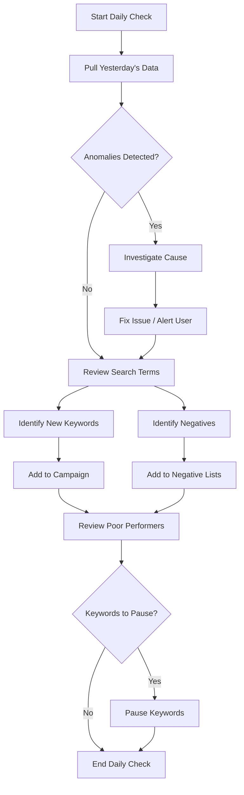
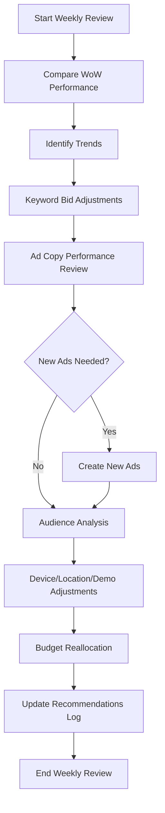

# Google Ads Optimization Playbook
## Kompletny Przewodnik Optymalizacji Konta - Framework dla Automatyzacji

---

## 🎯 Cel Dokumentu
Ten dokument definiuje **WSZYSTKIE czynności** jakie wykonuje specjalista Google Ads przy optymalizacji konta.
Zostanie użyty jako **blueprint** dla aplikacji automatyzującej te procesy.

---

# CZĘŚĆ 1: STRUKTURA PROCESU OPTYMALIZACJI

## 1.1 Hierarchia Zadań Specjalisty

### 🔴 CODZIENNE (Daily Checks)
**Czas: 15-30 min/konto**

1. **Sprawdzenie wydatku**
   - Czy jesteśmy w budżecie?
   - Czy jakieś kampanie nie "uciekły" z budżetem?
   - Alert: Spend today > 150% avg daily spend

2. **Identyfikacja anomalii**
   - Nagłe spadki/wzrosty:
     - CTR drop > 30%
     - CPC spike > 50%
     - Conversions = 0 (przy normalnym traffic)
   - Możliwe przyczyny: konkurencja, sezonowość, błędy w kampanii

3. **Search Terms Review** (⭐ NAJWAŻNIEJSZE)
   - Nowe search terms z poprzedniego dnia
   - Identyfikacja:
     - **Negatywnych słów** (irrelevant queries)
     - **Nowych słów kluczowych** (high-performing terms)
   - Reguła: Jeśli term ma >3 conversions i CVR > średnia kampanii → dodaj jako keyword

4. **Pause Poor Performers**
   - Keywords/Ads z:
     - Spend > $X bez conversion (np. $50)
     - CTR < 1% (Search campaigns)
     - Quality Score < 3

---

### 🟡 TYGODNIOWE (Weekly Reviews)
**Czas: 1-2 godziny/konto**

1. **Performance Analysis**
   - Porównanie Last 7 days vs Previous 7 days:
     - Spend, Clicks, CTR, CPC, Conversions, CVR, CPA/ROAS
   - Identyfikacja trendów (wzrost/spadek)

2. **Keyword Optimization**
   - Bid adjustments:
     - High performers (CVR > avg, CPA < target) → zwiększ bid o 10-20%
     - Low performers → zmniejsz bid o 20% LUB pause
   - Match type optimization:
     - Broad match terms z niskim CTR → zmień na Phrase
     - Phrase match z wysokim waste → dodaj negatywy

3. **Ad Copy Testing**
   - Przegląd wyników A/B testów
   - Pause ads z CTR < 50% best performer
   - Tworzenie nowych wariantów (testuj 3-4 ads/ad group)

4. **Audience Analysis**
   - Segmentacja wyników po:
     - Demographics (age, gender)
     - Devices (mobile vs desktop)
     - Locations (geography)
   - Bid adjustments: zwiększ dla top performers, zmniejsz dla słabych

5. **Budget Reallocation**
   - Przesunięcie budżetu z low ROAS campaigns → high ROAS campaigns
   - Reguła: Jeśli Campaign A: ROAS 800%, Campaign B: ROAS 200% → przenieś 20% z B do A

---

### 🟢 MIESIĘCZNE (Monthly Deep Dives)
**Czas: 3-5 godzin/konto**

1. **Competitor Analysis**
   - Auction Insights: kto wygrywa aukcje?
   - Impression Share analysis: gdzie tracimy udział?
   - Strategie: zwiększanie budżetu lub bid dla straconych aukcji

2. **Landing Page Analysis**
   - Bounce rate, time on site per campaign
   - Konwersje per landing page
   - Rekomendacje dla webmastera (CRO)

3. **Account Structure Audit**
   - Czy kampanie są logicznie podzielone?
   - Single Keyword Ad Groups (SKAGs) vs tematyczne grupy
   - Negative keyword lists maintenance

4. **Quality Score Deep Dive**
   - Identyfikacja keywords z QS < 5
   - Plan naprawy:
     - Poprawa ad relevance (lepszy ad copy)
     - Poprawa landing page experience
     - Expected CTR boost (testowanie ads)

5. **Attribution Analysis**
   - Last-click vs first-click vs linear attribution
   - Identyfikacja assisted conversions
   - Optymalizacja dla pełnego lejka (TOF, MOF, BOF)

---

# CZĘŚĆ 2: METRYKI I THRESHOLDY

## 2.1 Kluczowe Metryki (KPIs)

### Podstawowe Metryki
| Metryka | Opis | Dobre Wartości (Search) |
|---------|------|------------------------|
| **CTR** | Click-Through Rate | >2% (branded), >1% (non-branded) |
| **CPC** | Cost Per Click | Zależy od branży (B2B: $3-50, e-commerce: $0.5-3) |
| **CVR** | Conversion Rate | >2% (średnia), >5% (bardzo dobrze) |
| **CPA** | Cost Per Acquisition | < target CPA (zdefiniowany przez biznes) |
| **ROAS** | Return on Ad Spend | >400% (e-commerce), >200% (lead gen) |
| **Impr. Share** | Udział w wyświetleniach | >80% (brand), >50% (generic) |
| **Quality Score** | Jakość keyword + ad + LP | 7-10 (dobrze), <5 (problem) |

### Zaawansowane Metryki
| Metryka | Kiedy używać | Jak interpretować |
|---------|--------------|-------------------|
| **Search Lost IS (Budget)** | Gdy kampania jest limited by budget | >20% → zwiększ budżet |
| **Search Lost IS (Rank)** | Gdy przegrywasz aukcje mimo budżetu | >30% → zwiększ bids lub QS |
| **Avg. Position** (deprecated) | Stare konta | Top 3 dla branded, Top 5 dla generic |
| **Abs. Top Impr. %** | Nowoczesna miara pozycji | >50% dla branded |
| **Wasted Spend** | Spend bez conversions | <20% total spend |

---

## 2.2 Reguły Decyzyjne (Decision Trees)

### REGUŁA 1: Kiedy PAUSOWAĆ Keyword?
```
IF (Spend > $50 AND Conversions = 0 AND Clicks > 30)
   → PAUSE keyword
   
IF (CTR < 0.5% AND Impressions > 1000)
   → PAUSE keyword (irrelevant)
   
IF (Quality Score < 3 AND Cost > $100)
   → PAUSE keyword (za drogi, zła jakość)
```

### REGUŁA 2: Kiedy ZWIĘKSZYĆ Bid?
```
IF (CVR > Avg_CVR_Campaign * 1.2 AND CPA < Target_CPA * 0.8)
   → INCREASE BID by 20%
   
IF (Impression Share < 50% AND Lost IS (Rank) > 30%)
   → INCREASE BID by 15%
   
IF (Avg. CPC < Max_CPC * 0.5 AND Conversions > 5)
   → INCREASE BID by 10% (mamy zapas)
```

### REGUŁA 3: Kiedy ZMNIEJSZYĆ Bid?
```
IF (CPA > Target_CPA * 1.5 AND Spend > $100)
   → DECREASE BID by 20%
   
IF (CTR < 1% AND CPC > Avg_CPC_Account * 1.3)
   → DECREASE BID by 15% (płacimy za złą jakość)
```

### REGUŁA 4: Kiedy DODAĆ Search Term jako Keyword?
```
IF (Search_Term.Conversions >= 3 AND Search_Term.CVR > Campaign.Avg_CVR)
   → ADD as EXACT match keyword
   
IF (Search_Term.Clicks > 10 AND Search_Term.CTR > 5%)
   → ADD as PHRASE match keyword
```

### REGUŁA 5: Kiedy DODAĆ Negative Keyword?
```
IF (Search_Term.Clicks > 5 AND Search_Term.Conversions = 0 AND Search_Term.CTR < 1%)
   → ADD as NEGATIVE (campaign level)
   
IF (Search_Term zawiera: "free", "cheap", "how to", "why", "download")
   → ADD as NEGATIVE (account level)
   
IF (Search_Term.Cost > $30 AND Conversions = 0)
   → ADD as NEGATIVE
```

### REGUŁA 6: Kiedy PAUSOWAĆ Ad?
```
IF (Ad.CTR < Best_Ad.CTR * 0.5 AND Ad.Impressions > 500)
   → PAUSE ad
   
IF (Ad.Conversions = 0 AND Ad.Cost > $50)
   → PAUSE ad
```

### REGUŁA 7: Kiedy REALOKOWAĆ Budżet?
```
IF (Campaign_A.ROAS > Campaign_B.ROAS * 2 AND Campaign_B.Budget > Campaign_A.Budget)
   → MOVE 20% of Campaign_B budget → Campaign_A
   
IF (Campaign.Lost_IS_Budget > 40% AND Campaign.ROAS > Target_ROAS)
   → INCREASE budget by 30%
```

---

# CZĘŚĆ 3: WORKFLOW OPTYMALIZACJI

## 3.1 Daily Optimization Flow



## 3.2 Weekly Optimization Flow



---

# CZĘŚĆ 4: SPECJALIZOWANE STRATEGIE

## 4.1 Search Terms Intelligence (⭐ Core Feature)

### Co to jest?
Analiza **rzeczywistych zapytań użytkowników** (search queries), które triggernęły nasze reklamy.

### Dlaczego to najważniejsze?
- Google Ads pokazuje reklamy na **więcej queries niż nasze keywords** (broad/phrase match)
- 20-30% search terms to "waste" (niekonwertujące zapytania)
- Hidden gems: queries z wysoką konwersją, których nie targetujemy

### Proces Analizy

#### Krok 1: Segmentacja Search Terms
```
Kategoria 1: HIGH PERFORMERS
- Conversions >= 3
- CVR > Avg Campaign CVR
- CPA < Target CPA
→ ACTION: Dodaj jako exact match keyword

Kategoria 2: WASTE (Negatives)
- Clicks > 5
- Conversions = 0
- CTR < 1%
→ ACTION: Dodaj jako negative keyword

Kategoria 3: TESTING (Observe)
- Clicks 1-5
- Brak wystarczających danych
→ ACTION: Monitor przez kolejne 7 dni

Kategoria 4: IRRELEVANT
- Zawiera: "free", "cheap", "job", "salary", "how to", "why"
→ ACTION: Immediate negative
```

#### Krok 2: Semantic Clustering (AI-Powered)
```python
# Grupowanie podobnych search terms
# Przykład: 
Group 1 "Purchase Intent":
  - "buy nike shoes online"
  - "nike shoes for sale"
  - "order nike sneakers"
  
Group 2 "Research Intent":
  - "nike shoes review"
  - "best nike running shoes"
  - "nike shoes comparison"

Group 3 "Irrelevant":
  - "nike shoes cheap replica"
  - "free nike shoes"
```

**Akcje:**
- Purchase Intent → Zwiększ bids, dodaj exact keywords
- Research Intent → Niższe bids, content-focused landing pages
- Irrelevant → Negatives

---

## 4.2 Correlation Matrix Analysis

### Co to jest?
Analiza **wzajemnych zależności** między kampaniami/grupami reklam.

### Przykłady Insightów:
```
Kampania A (Brand) + Kampania B (Generic) = Negative Correlation
→ Insight: Brand campaign cannibalizes generic (users who searched brand 
  would convert anyway, nie potrzebujemy generic)
→ ACTION: Zmniejsz bid na generic branded terms

Kampania C (TOF) + Kampania D (BOF) = Positive Correlation
→ Insight: Top-of-funnel traffic pomaga w bottom-of-funnel conversions
→ ACTION: Zwiększ budżet na TOF
```

### Formuła:
```
Correlation = Pearson correlation coefficient między:
- Daily Conversions Campaign A vs Campaign B
- Daily Spend Campaign A vs Campaign B

Jeśli r > 0.7 → Strong Positive (synergy)
Jeśli r < -0.7 → Strong Negative (cannibalization)
```

---

## 4.3 Quality Score Optimization

### Co wpływa na QS?
1. **Expected CTR** (50% wagi)
   - Historyczne CTR keyword
   - Czy ad copy jest relevantny?
   
2. **Ad Relevance** (25% wagi)
   - Czy keyword jest w ad copy?
   - Czy message match?
   
3. **Landing Page Experience** (25% wagi)
   - Page load speed
   - Mobile-friendly
   - Relevant content

### Proces Naprawy QS < 5:

```
1. Expected CTR Problem:
   - Utwórz SKAG (Single Keyword Ad Group)
   - Ad headline MUST contain exact keyword
   - Test 3-4 różne CTAs
   
2. Ad Relevance Problem:
   - Keyword w Headline 1
   - Keyword w Description
   - Użyj DKI (Dynamic Keyword Insertion)
   
3. Landing Page Problem:
   - Ensure keyword on LP (H1, first paragraph)
   - Improve load speed (<3s)
   - Clear CTA above the fold
```

---

## 4.4 Bid Strategy Optimization

### Kiedy używać której strategii?

| Strategia | Kiedy używać | Pros | Cons |
|-----------|--------------|------|------|
| **Manual CPC** | Start, małe konta, pełna kontrola | Kontrola, przejrzystość | Czasochłonne |
| **Enhanced CPC** | Średnie konta, chcemy Google pomocy | Balance control + automation | Może overspend |
| **Maximize Clicks** | Budowanie traffic, brand awareness | Dużo kliknięć | Brak kontroli CPA |
| **Target CPA** | Lead gen, e-commerce z jasnym target | Predictable CPA | Wymaga dużo danych (30+ conv/month) |
| **Target ROAS** | E-commerce z transaction values | Maximize revenue | Wymaga conversion value tracking |
| **Maximize Conversions** | Chcemy jak najwięcej konwersji | Google optymalizuje | Może overspend |

### Kiedy ZMIENIĆ strategię?
```
IF Manual CPC AND Conversions > 50/month AND CPA stabilne
  → TEST Target CPA (ustaw na Avg CPA * 1.1)

IF Target CPA AND CPA > Target * 1.5 przez 14 dni
  → REVERT to Manual CPC or Enhanced CPC

IF Maximize Conversions AND Cost/Conv rosnący > 30% MoM
  → SWITCH to Target CPA
```

---

# CZĘŚĆ 5: ADVANCED FEATURES (dla aplikacji)

## 5.1 Anomaly Detection

### Algorytm:
```python
# Statistical Anomaly Detection
def detect_anomalies(metric_data, window=30):
    """
    metric_data: lista wartości (np. daily spend ostatnie 30 dni)
    
    Metody:
    1. Z-Score: |value - mean| / std_dev > 3 → anomaly
    2. IQR Method: value < Q1 - 1.5*IQR OR value > Q3 + 1.5*IQR → anomaly
    3. Moving Average: value > MA * 1.5 OR value < MA * 0.5 → anomaly
    """
    pass
```

### Przykładowe Anomalie:
- **Spend Spike:** Dzisiejszy spend > 200% średniej → sprawdź czy nie błąd w budget settings
- **CTR Drop:** CTR today < 50% avg CTR → sprawdź czy ads nie zostały disapproved
- **Conversion Drop:** Conversions = 0 gdy normalnie 5-10/dzień → sprawdź tracking code

---

## 5.2 Predictive Analytics

### Forecasting Spend & Conversions
```python
# Simple Linear Regression Forecast
from sklearn.linear_model import LinearRegression

# Predict next 7 days spend based on last 30 days trend
X = np.array(range(30)).reshape(-1, 1)  # days
y = last_30_days_spend

model = LinearRegression()
model.fit(X, y)

next_7_days = model.predict(np.array(range(30, 37)).reshape(-1, 1))
```

**Use case:** 
- "Based on current trend, you'll spend $X by end of month"
- "You need to increase daily budget by $Y to hit monthly goal"

---

## 5.3 Automated Recommendations

### Recommendation Engine Logic:

```python
recommendations = []

# Check 1: Budget Limited Campaigns
if campaign.lost_is_budget > 0.3 and campaign.roas > target_roas:
    recommendations.append({
        'type': 'INCREASE_BUDGET',
        'campaign': campaign.name,
        'current': campaign.budget,
        'recommended': campaign.budget * 1.3,
        'reason': f'Lost {campaign.lost_is_budget*100}% impressions due to budget. ROAS is healthy.',
        'priority': 'HIGH'
    })

# Check 2: Poor Performing Keywords
for kw in keywords:
    if kw.spend > 50 and kw.conversions == 0:
        recommendations.append({
            'type': 'PAUSE_KEYWORD',
            'keyword': kw.text,
            'spend': kw.spend,
            'reason': 'No conversions after $50 spend',
            'priority': 'MEDIUM'
        })

# Check 3: High Performing Search Terms
for term in search_terms:
    if term.conversions >= 3 and term.cvr > campaign.avg_cvr:
        if term.text not in campaign.keywords:
            recommendations.append({
                'type': 'ADD_KEYWORD',
                'search_term': term.text,
                'conversions': term.conversions,
                'cvr': term.cvr,
                'reason': f'High performing search term ({term.conversions} conversions, {term.cvr}% CVR)',
                'priority': 'HIGH'
            })
```

---

# CZĘŚĆ 6: IMPLEMENTATION CHECKLIST

## Co aplikacja MUSI umieć (MVP):

### ✅ Data Collection
- [ ] Sync z Google Ads API (campaigns, ad groups, keywords, ads, search terms)
- [ ] Store locally w SQLite
- [ ] Daily automated sync (cron job)

### ✅ Basic Analytics
- [ ] Dashboard z KPIs (Spend, Conversions, ROAS, CTR, CPC)
- [ ] Wykresy trendów (ostatnie 30 dni)
- [ ] Comparison: Today vs Yesterday, This Week vs Last Week

### ✅ Search Terms Intelligence
- [ ] Lista wszystkich search terms
- [ ] Filtrowanie: High Performers, Waste, Testing
- [ ] Semantic clustering (grupowanie podobnych)
- [ ] One-click actions: Add as Keyword, Add as Negative

### ✅ Automated Recommendations
- [ ] Daily scan konta
- [ ] Generowanie listy rekomendacji (pause, increase bid, add negative, etc.)
- [ ] Priorytetyzacja (HIGH, MEDIUM, LOW)
- [ ] One-click apply recommendation

### ✅ Anomaly Detection
- [ ] Alert gdy Spend > 150% avg
- [ ] Alert gdy Conversions = 0 (expected > 0)
- [ ] Alert gdy CTR drop > 30%

---

## Co aplikacja POWINNA umieć (v2):

### 🔄 Automated Rules
- [ ] User-defined rules (e.g., "Pause keyword if spend > $50 and conv = 0")
- [ ] Scheduled execution (daily, weekly)
- [ ] Rule history & rollback

### 📊 Advanced Analytics
- [ ] Correlation Matrix
- [ ] Attribution Analysis
- [ ] Cohort Analysis (performance by week-of-signup)

### 🤖 AI-Powered Features
- [ ] Ad copy generator (GPT-based)
- [ ] Keyword expansion suggestions
- [ ] Competitive intelligence (auction insights analysis)

---

# CZĘŚĆ 7: PRZYKŁADOWE SCENARIUSZE

## Scenariusz 1: Nowe Konto (Cold Start)
```
Dzień 1-7:
- Setup tracking (conversion tracking)
- Launch initial campaigns (branded + top generic keywords)
- Bids: Manual CPC, conservative (start low)
- Monitor Daily: Spend, CTR, Quality Score

Dzień 8-30:
- Pierwszy Search Terms Review → dodaj negatives
- Identyfikuj top performers → zwiększ bids
- Pause keywords z QS < 3
- Test różne ad copies (3-4 warianty)

Miesiąc 2:
- Jeśli Conversions > 30/month → TEST Target CPA
- Budget reallocation (high ROAS campaigns)
- Landing page optimization based on data

Miesiąc 3+:
- Scaling (zwiększanie budżetu dla winners)
- Expansion (nowe campaigns, audiences)
- Automation (automated rules)
```

## Scenariusz 2: Optymalizacja Istniejącego Konta
```
Audit Checklist:
1. Account Structure
   - Czy kampanie są logicznie podzielone?
   - Czy ad groups mają <20 keywords? (jeśli więcej → split)
   
2. Wasted Spend Analysis
   - Ile % budżetu idzie na non-converting terms?
   - Negative keywords coverage (czy mamy comprehensive lists?)
   
3. Quality Score Audit
   - Ile % keywords ma QS < 5?
   - Plan naprawy (SKAGs, ad relevance, LP improvements)
   
4. Performance Gaps
   - Które campaigns mają ROAS < target?
   - Które keywords mają CPA > target?
   - Immediate actions: pause, decrease bids

5. Opportunities
   - High Impression Share Lost (Budget) → increase budget
   - High performing search terms not yet keywords → add
   - Low competition keywords → increase bids
```

---

# CZĘŚĆ 8: METRYKI SUKCESU APLIKACJI

## Jak mierzyć czy aplikacja działa?

### Przed/Po Implementacji:
| Metryka | Przed | Po (Expected) |
|---------|-------|---------------|
| **Wasted Spend %** | 25% | <15% |
| **Avg Quality Score** | 5.2 | >6.5 |
| **Conversions/Month** | 100 | +20-30% (120-130) |
| **CPA** | $50 | -15-25% ($37-42) |
| **ROAS** | 300% | +30-50% (390-450%) |
| **Time Spent on Management** | 10 hrs/week | <2 hrs/week |

### ROI Aplikacji:
```
Monthly Savings = (Reduced Wasted Spend) + (Time Saved * Hourly Rate)

Przykład:
- Reduced Waste: $10,000 * 0.10 (zmniejszenie waste z 25% do 15%) = $1,000
- Time Saved: 8 hrs/week * 4 weeks * $100/hr = $3,200
- Total Monthly Savings: $4,200

Jeśli aplikacja kosztuje $500/month → ROI = 740%
```

---

# KONIEC - PLAYBOOK GOTOWY DO IMPLEMENTACJI

## Następne Kroki:
1. **Priorytetyzacja funkcji** - które części zaimplementować najpierw?
2. **Mapowanie na kod** - które endpoints/services odpowiadają którym procesom?
3. **Data models** - jakie tabele w bazie danych potrzebujemy?
4. **UI mockups** - jak będą wyglądały ekrany aplikacji?

---

**Pytania? Uwagi? Gotowy do kodu? 🚀**
